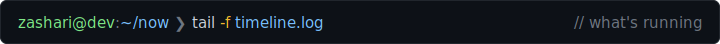

<div align="center">


</div>

---


```yaml
name      : Andi Izzat Zaky Ashari
role      : AI Engineer  ·  Software Engineer  ·  Software Architect
currently : Full-Stack Software Engineer  @  marketbetter.ai
            Software Architect            @  Ashari Tech
location  : Bandung, Indonesia  ·  remote
education : B.Sc. Computer Science, BINUS University (2021 – 2025)
focus     : AI/ML  ·  full-stack  ·  cloud infrastructure  ·  LLM platforms
```


```
┌─ languages ──────────────────────────────────────────────────┐
│  TypeScript    JavaScript    Python    Go    SQL    R        │
├─ frontend ───────────────────────────────────────────────────┤
│  React    Next.js    Tailwind CSS    HTML / CSS              │
├─ runtime · backend ──────────────────────────────────────────┤
│  Node.js    Bun    Elysia.js    REST    Socket.IO / WS       │
├─ ai · ml ────────────────────────────────────────────────────┤
│  TensorFlow    PyTorch    OpenAI    Gemini    MCP            │
│  Deep Learning    Model Deployment                           │
├─ data ───────────────────────────────────────────────────────┤
│  PostgreSQL    MongoDB    Supabase    Redis                  │
├─ cloud · infra ──────────────────────────────────────────────┤
│  AWS (Lambda · S3 · EC2)    GCP    Cloudflare (R2 · Tunnel)  │
│  Docker / Docker Swarm    Terraform    GitHub Actions        │
└──────────────────────────────────────────────────────────────┘
```



```
[ 2025·09 ]  ●  Full-Stack Software Engineer  ·  marketbetter.ai
                1,500+ commits  ·  ~480 PRs  ·  7 repos  ·  8 months
                shipped 8+ flagship modules at startup velocity

[ 2025·03 ]  ●  Software Architect  ·  Ashari Tech
                co-architecting asharicloud-genapi (OpenAI-compatible
                LLM gateway in Go) + multi-tenant platform infra

[ 2024·02 ]  ◐  ML Engineer Intern  ·  GDP Labs  (completed 2025·02)
                production fraud-detection pipeline  ·  89% recall
                exceeded the 80% benchmark for a major ID bank
```


```
alzheimer-detection     multi-modal deep learning on MRI
                        (2D + 3D + radiomic feature fusion)

brainybuddy             Indonesian AI companion · Telegram + LINE
                        Bun + Elysia.js + MongoDB + Supabase

asharicloud-genapi      OpenAI-compatible LLM gateway in Go
                        multi-vendor routing · Docker Swarm

leukemia-classifier     CNN + YOLO on blood-cell images
                        dual-channel feature fusion · ALL detection

deepfake-research       CNN + LSTM and Capsule Networks
                        face-aligned preprocessing · 90% accuracy
```


<p align="left">
  <a href="https://www.linkedin.com/in/zaky-ashari-81143b217/">
    
  </a>
  <a href="https://github.com/zashari">
    
  </a>
  <a href="mailto:izzat.zaky@gmail.com">
    
  </a>
  <a href="https://www.instagram.com/a.zakyashari">
    
  </a>
</p>

<sub>`$ echo "thanks for stopping by"`</sub>
