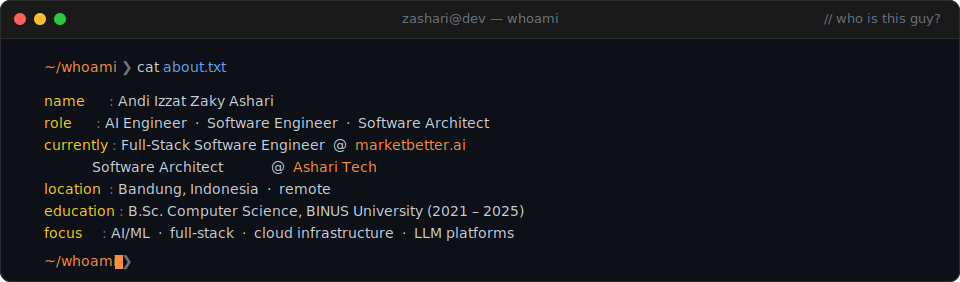
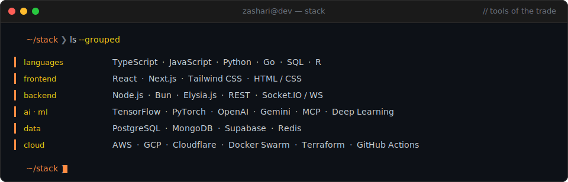
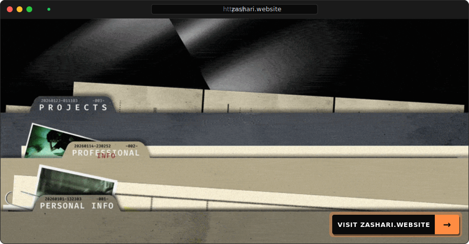

---

 
 

<pre>
● ● ●                            zashari@dev — connect                            // let's talk
─────────────────────────────────────────────────────────────────────────────────────────

~/connect ❯ ssh me@zashari

  linkedin    :  <a href="https://www.linkedin.com/in/zaky-ashari-81143b217/">zaky_ashari</a>
  github      :  <a href="https://github.com/zashari">zashari</a>
  email       :  <a href="mailto:izzat.zaky@gmail.com">izzat.zaky@gmail.com</a>
  instagram   :  <a href="https://www.instagram.com/a.zakyashari">a.zakyashari</a>

~/connect ❯ █
</pre>
