---

 
 

  &nbsp;&nbsp;<a href="https://www.linkedin.com/in/zaky-ashari-81143b217/" target="_blank" rel="noopener noreferrer"><b>linkedin</b></a>
  &nbsp;·&nbsp;
  <a href="https://github.com/zashari" target="_blank" rel="noopener noreferrer"><b>github</b></a>
  &nbsp;·&nbsp;
  <a href="mailto:izzat.zaky@gmail.com"><b>email</b></a>
  &nbsp;·&nbsp;
  <a href="https://www.instagram.com/a.zakyashari" target="_blank" rel="noopener noreferrer"><b>instagram</b></a>

